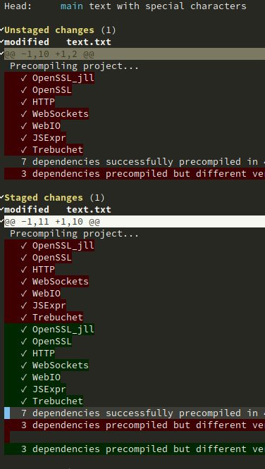

To replicate the second commit on this repository,

- Clone this repository, and create a new branch from the first commit: git switch -c test HEAD~1
- remove the lines with the ANSI escape characters
  - trying to stage a patch (`s` on the patch area) it throws an error:
      ```
      1 git … apply --cached -p0 --ignore-space-change -
      error: patch failed: text.txt:1
      error: text.txt: patch does not apply
      ```
  - staged the file fully (`s` on the filename)
  - unstaged the few first lines of the file, and then the rest as patches. We get the image.
    
  - commit that
  - discard the "deletions" (`k`)on the staging area.
  - Look at the diff between both commits (`git diff HEAD~1`) shows that the ANSI escape sequences have disappeared.

Trying to replicate the same steps using `git restore -p --staged` doesn't produce the same error.

I'm using delta as a diff showing. That may have something to do with it.

